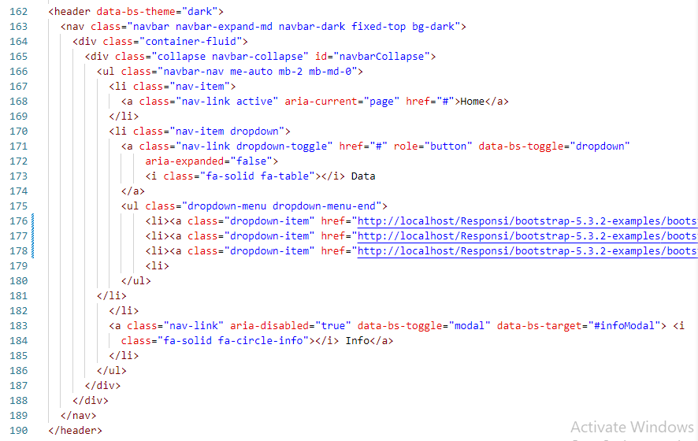
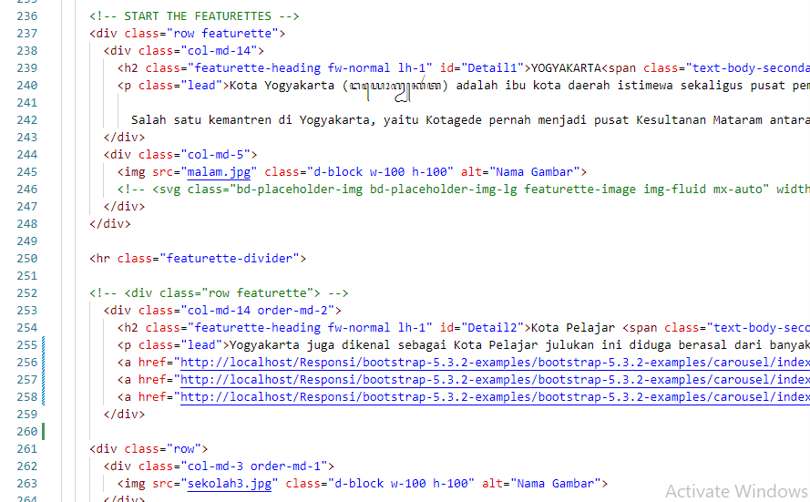
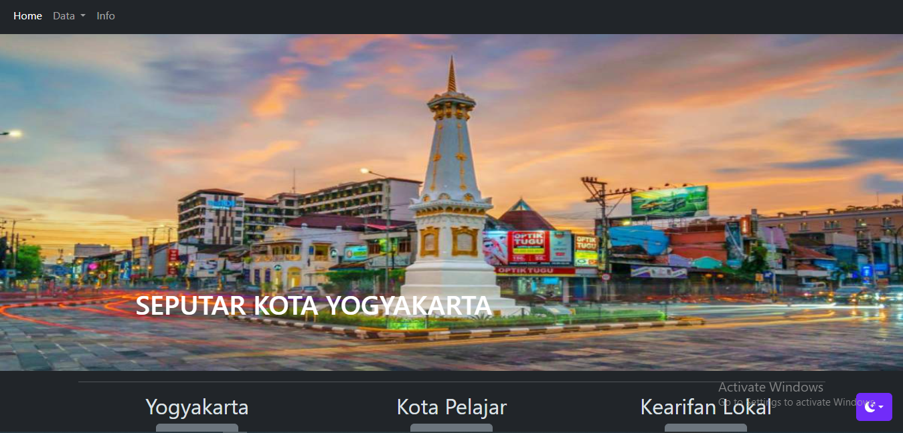

# PGWEB_Responsi_Enjelllia_498941
# responsi
WEBGIS Seputar Kota Yogyakarta

WeGIS ini merupakan suatu web yang digunakan untuk memberikan informasi terkait kota yogyakarta mulai dari pengertian kota yogyakarta, pendidikan yang terdaat dikota yogyakarta, dan wisata dengan beragam cagar budaya serta informasi terkait jumlah penduduk dan lain sebagainya. 
Komponen pembangun Produk: Leaftlet js, Bootstrap, Geoserver, Localhost PHP My Admin, BPS kota Yogyakarta tahun 2022, Bahasa HTMl, PHP, CSS
Sumber Data:
BPS kota Yogyakarta Tahun 2022
Shapefile Kota Yogyakarta
Shapefile titik pendidikan Kota Yogyakarta 
Shapefile Cagar Budaya Kota Yogyakarta
Data SMA dan SMP
Tangkapan Layar Bagian Penting Produk:

Script NavBar

Isi Produk

Tampilan Produk 

